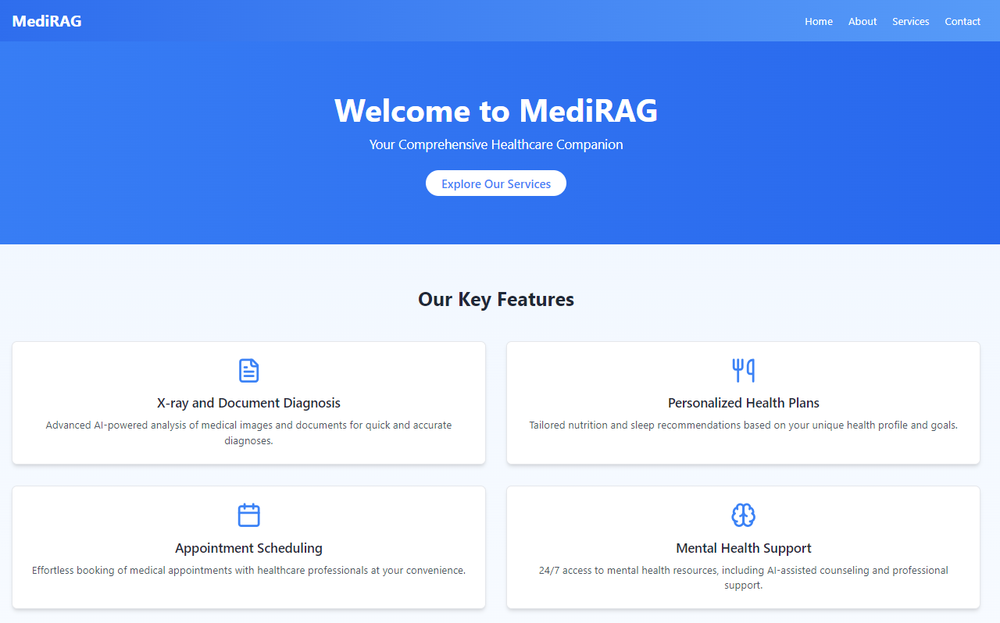
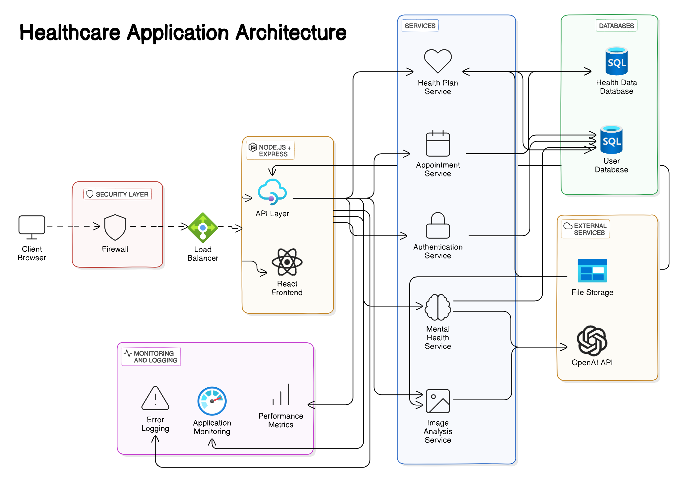
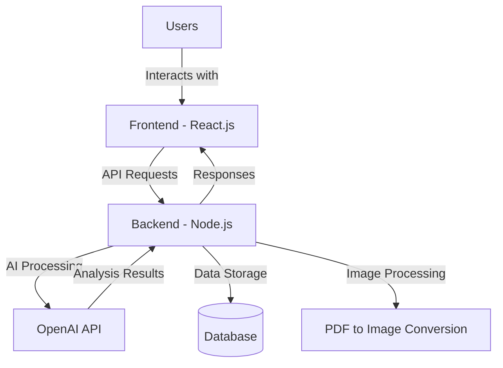
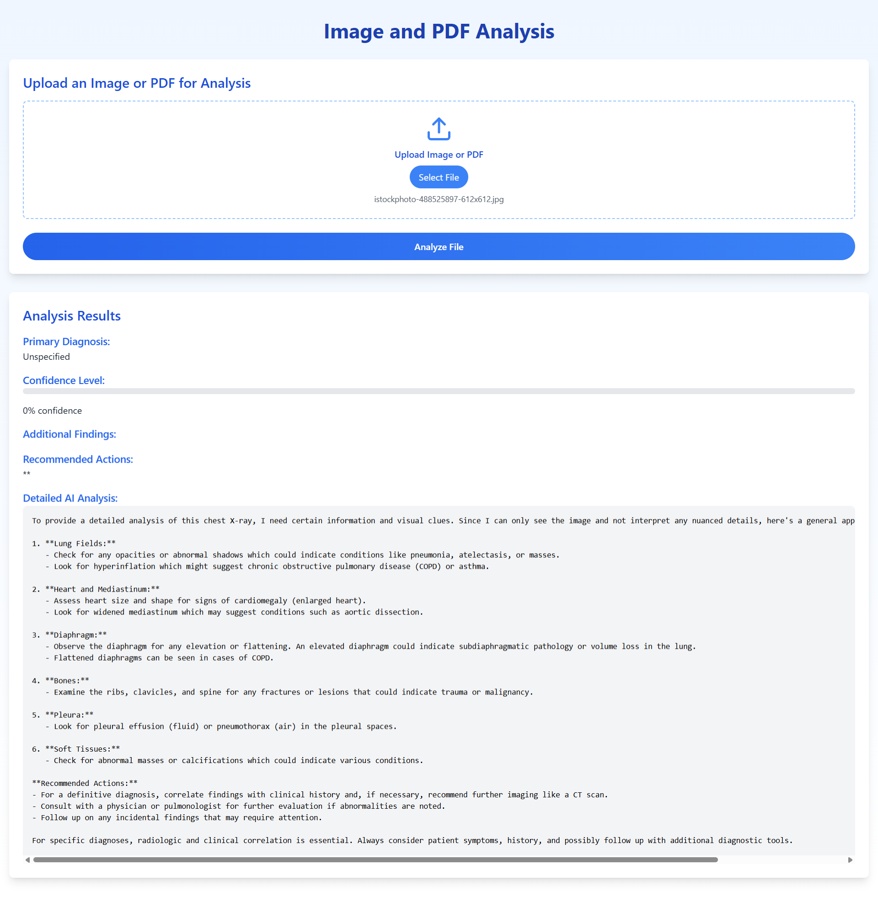
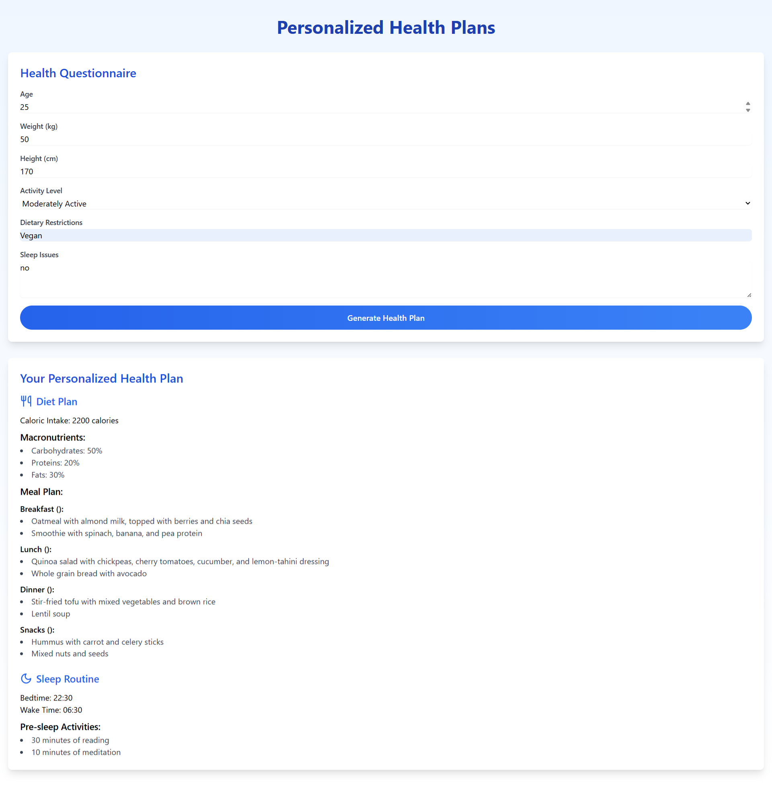
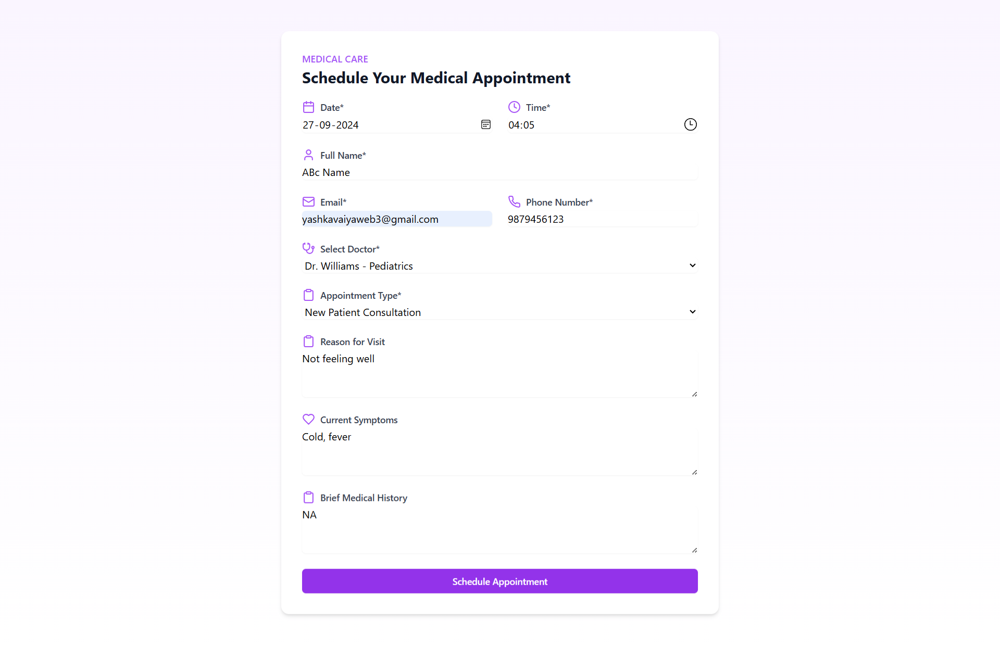
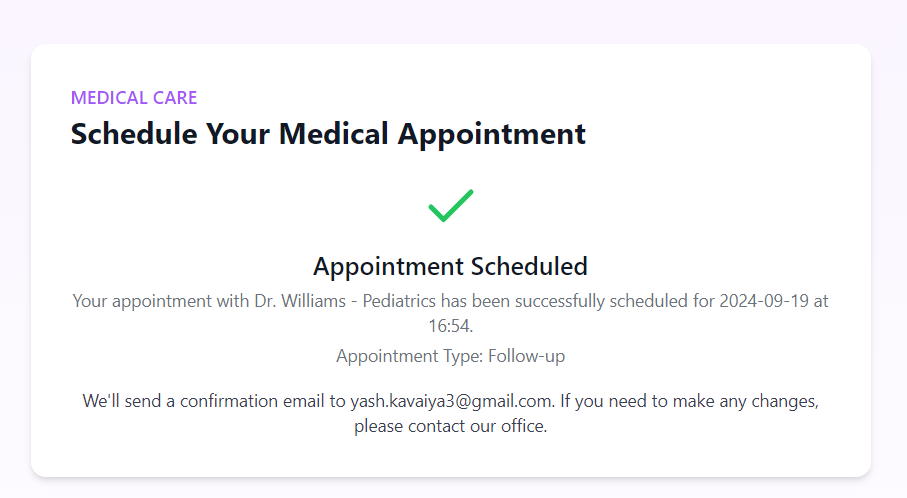
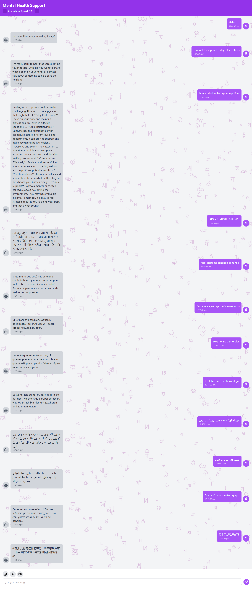
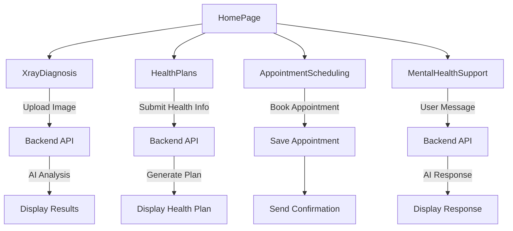

# MediRAG - Intelligent Healthcare Solutions 🏥✨



## 📋 Overview

MediRAG is a comprehensive healthcare platform that leverages artificial intelligence to provide accessible, personalized healthcare solutions. Built with modern web technologies including JavaScript, TypeScript, and Node.js, it aims to revolutionize patient care, streamline medical processes, and provide easy access to health-related information and services.

> 💡 **Vision**: Making quality healthcare accessible through intelligent technology integration

## 🏗️ Healthcare Application Architecture

The MediRAG platform follows a client-server architecture with AI integration for advanced healthcare features.



### System Architecture Diagram




## ✨ Key Features

### 🔍 X-ray and Document Diagnosis
- AI-powered analysis of medical images and documents
- Quick and accurate diagnoses with confidence levels
- Support for various file formats including images and PDFs
- Detailed analysis reports with recommendations



### 🥗 Personalized Health Plans
- Tailored nutrition recommendations based on individual profiles
- Custom sleep routines addressing specific sleep issues
- Personalized caloric intake and macronutrient distribution
- Daily meal plans with timing suggestions



### 📅 Appointment Scheduling
- Intuitive interface for booking medical appointments
- Selection from various healthcare professionals
- Customizable appointment types and reasons
- Automatic email confirmations and reminders

<!-- 


-->

### 🧠 Mental Health Support
- 24/7 access to AI-assisted mental health resources
- Interactive chatbot with empathetic responses
- Integration with professional support services
- Relaxation exercises and resources



## 🛠️ Technology Stack

| Layer | Technologies |
|-------|-------------|
| **Frontend** | React.js, TypeScript, Tailwind CSS |
| **Backend** | Node.js, Express |
| **AI Integration** | OpenAI API |
| **File Processing** | Multer, pdf-img-convert |
| **Styling** | Tailwind CSS, Lucide React (icons) |
| **Routing** | React Router |
| **HTTP Requests** | Axios |

## 🚀 Setup Instructions

### Prerequisites
- Node.js (v14 or higher)
- npm or yarn
- OpenAI API key

### Installation

1. **Clone the repository**:
   ```bash
   git clone https://github.com/your-username/healthcare-website.git
   cd healthcare-website
   ```

2. **Setup the backend**:
   ```bash
   cd backend
   npm install
   ```

3. **Setup the frontend**:
   ```bash
   cd ../frontend
   npm install
   ```

4. **Configure environment variables**:
   Create a `.env` file in the backend directory with:
   ```
   PORT=3001
   OPENAI_API_KEY=your_openai_api_key
   DATABASE_URL=your_database_connection_string
   ```

5. **Start the development servers**:
   
   For backend:
   ```bash
   cd backend
   npm run dev
   ```
   
   For frontend:
   ```bash
   cd frontend
   npm start
   ```

6. **Access the application**:
   Open your browser and navigate to `http://localhost:3000`

## 📡 API Endpoints

| Endpoint | Method | Description | Request Body | Response |
|----------|--------|-------------|--------------|----------|
| `/api/analyze-image` | POST | Analyze medical images | File upload (image/PDF) | Diagnosis results with confidence level |
| `/api/HealthPlans` | POST | Generate health plans | Age, weight, height, activity level, dietary restrictions, sleep issues | Personalized diet and sleep routine |
| `/api/mental-health-chat` | POST | Mental health chat | User message | AI assistant response |
| `/api/test` | GET | Test backend connectivity | - | Connection status |
| `/api/appointments` | Various | Manage appointments | Appointment details | Confirmation/details |

## 📦 Project Structure

```
healthcare-website/
├── backend/               # Node.js backend
│   ├── index.js           # Main server file
│   ├── uploads/           # Storage for uploaded files
│   └── package.json       # Backend dependencies
├── frontend/              # React frontend
│   ├── public/            # Static files
│   ├── src/               # Source code
│   │   ├── components/    # React components
│   │   ├── styles/        # CSS styles
│   │   ├── api/           # API service files
│   │   └── routes/        # Frontend routes
│   └── package.json       # Frontend dependencies
└── README.md              # Project documentation
```

## 🔄 Component Flow



## 🧪 Features in Detail

### X-ray Diagnosis Process

1. **Upload**: User uploads X-ray image or PDF document
2. **Processing**: System converts PDFs to images if needed
3. **AI Analysis**: OpenAI API analyzes the image with expert radiologist prompting
4. **Results**: System returns diagnosis, confidence level, and recommendations

### Health Plan Generation

1. **Input Collection**: User provides health information and preferences
2. **AI Processing**: System generates personalized diet and sleep plans
3. **Presentation**: Interactive display of health recommendations
4. **Follow-up**: Optional monitoring and adjustment features

### Mental Health Support System

1. **User Interface**: Chatbot with friendly, empathetic design
2. **Context Management**: Conversation history tracking for coherent responses
3. **AI Responses**: Empathetic and supportive message generation
4. **Resources**: Integration with relaxation videos and exercises
